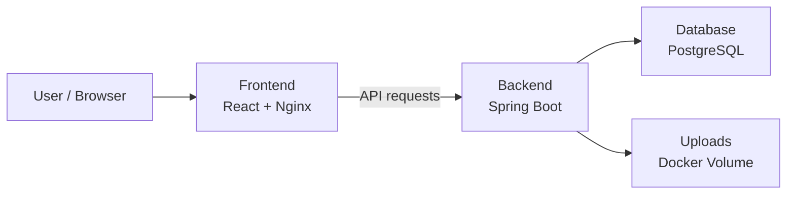

# Social Media Web Application

A full-stack social media web application built with React, Spring Boot, and PostgreSQL. The application provides user authentication, profiles, posts, comments, follow relationships, search, personalized feeds, and image uploads.

The application is containerized with Docker Compose and includes automated backend testing and continuous integration through GitHub Actions.

## Features

* User registration and authentication
* JWT-based stateless authentication
* User profiles and profile management
* Password changes and account deletion
* Follow and unfollow users
* Follower and following lists
* Follow suggestions and recent followers
* Create, edit, and delete posts
* Image uploads for users and posts
* Post comments
* Personalized user feed
* User search
* RESTful API
* Persistent PostgreSQL database
* Persistent uploaded files through Docker volumes
* Automated unit and controller tests
* PostgreSQL integration testing with Testcontainers
* Continuous integration with GitHub Actions
* Docker Compose orchestration for the complete application stack

## Architecture

The application is composed of three containerized services:

### 1. Frontend

A **React application built with Vite**. In production, the compiled frontend is served by **Nginx**.

Nginx serves the application's web interface and proxies API requests to the backend.

### 2. Backend

A **Spring Boot REST API** that handles the application's business logic.

The backend is responsible for:

* User authentication and authorization
* User and profile management
* Posts and comments
* Follow relationships
* Feed generation
* Search
* Image uploads
* Database access

### 3. Database

A **PostgreSQL 18** database that stores persistent application data, including users, posts, comments, and follow relationships.

The database is backed by a Docker named volume so data persists when the database container is restarted or recreated.

### Service Communication

The three services communicate through a Docker Compose network:



When running with Docker Compose:

* The browser connects to the **frontend** on port `3000`.
* Nginx serves the React application and forwards `/api/` requests to the **backend**.
* The **backend** communicates with PostgreSQL using the Compose service name `db` on port `5432`.
* Uploaded images are stored in a persistent Docker volume mounted by the backend.

This keeps the three application components separated while allowing Docker Compose to manage them as a single application stack.

The backend is organized by application domain, including:

* Authentication
* Users
* Posts
* Comments
* Follows
* Feed
* Search
* Uploads
* Security and configuration

## Technology Stack

### Frontend

* React
* Vite
* JavaScript
* Nginx
* Sass

### Backend

* Java 21
* Spring Boot 3.3.5
* Spring Web
* Spring Data JPA
* Spring Security
* Hibernate
* Jakarta Validation
* Maven

### Database

* PostgreSQL 18

### Authentication

* JSON Web Tokens (JWT)
* Spring Security
* BCrypt password hashing
* JJWT

### Testing

* JUnit
* Mockito
* Spring Boot Test
* Testcontainers
* PostgreSQL Testcontainer

### Infrastructure and CI

* Docker
* Docker Compose
* GitHub Actions

## Project Structure

```text
.
├── back-end/
│   ├── src/
│   │   ├── main/
│   │   │   ├── java/com/steph/
│   │   │   │   ├── auth/
│   │   │   │   ├── comment/
│   │   │   │   ├── config/
│   │   │   │   ├── exceptions/
│   │   │   │   ├── feed/
│   │   │   │   ├── follows/
│   │   │   │   ├── post/
│   │   │   │   ├── search/
│   │   │   │   ├── upload/
│   │   │   │   └── user/
│   │   │   └── resources/
│   │   │       └── application.properties
│   │   └── test/
│   │       ├── java/
│   │       └── resources/
│   ├── Dockerfile
│   ├── pom.xml
│   └── README.md
│
├── front-end/
│   ├── src/
│   │   ├── components/
│   │   ├── context/
│   │   ├── pages/
│   │   ├── services/
│   │   └── utils/
│   ├── Dockerfile
│   ├── nginx.conf
│   ├── package.json
│   └── README.md
│
├── .env.example
├── docker-compose.yml
└── README.md
```

## Running the Application with Docker

Docker Compose is the recommended way to run the complete application.

### Prerequisites

Install:

* Docker Engine
* Docker Compose

### 1. Clone the repository

```bash
git clone git@github.com:stephaneagg/Spring-Boot-WebApp.git
cd Spring-Boot-WebApp
```

### 2. Create the environment file

Copy the example environment file:

```bash
cp .env.example .env
```

Update `.env` with appropriate local values.

Example:

```env
DB_NAME=pgdev
DB_USER=stephg
DB_PASSWORD=change-me

JWT_SECRET=your-base64-encoded-secret
JWT_EXPIRATION=86400000
JWT_REFRESH_EXPIRATION=604800000

```

### 3. Start the application

```bash
docker compose up -d --build
```

Docker Compose starts:

1. PostgreSQL
2. Spring Boot backend
3. React/Nginx frontend

The backend waits for PostgreSQL to become healthy before starting, and the frontend waits for the backend to become healthy.

### 4. Check service status

```bash
docker compose ps
```

All three services should eventually report a healthy status.

### 5. Access the application

Frontend:

```text
http://localhost:3000
```

Backend:

```text
http://localhost:8080
```

PostgreSQL:

```text
localhost:5332
```

The PostgreSQL container listens on port `5432`; port `5332` is exposed on the host for local database tools such as DBeaver.

### 6. Stop the application

```bash
docker compose down
```

Stopping the stack does not remove the named database or upload volumes.

To remove the containers and associated volumes:

```bash
docker compose down -v
```

> **Warning:** removing the volumes deletes the Docker-managed database and uploaded-file data.

## Environment Configuration

The application uses environment variables for configuration that should not be hard-coded into the application or committed to source control.

| Variable                 | Purpose                                |
| ------------------------ | -------------------------------------- |
| `DB_NAME`                | PostgreSQL database name               |
| `DB_USER`                | PostgreSQL username                    |
| `DB_PASSWORD`            | PostgreSQL password                    |
| `JWT_SECRET`             | Base64-encoded JWT signing secret      |
| `JWT_EXPIRATION`         | Access token lifetime in milliseconds  |
| `JWT_REFRESH_EXPIRATION` | Refresh token lifetime in milliseconds |

The repository includes `.env.example` as a configuration template.

## API Overview

The backend exposes versioned REST endpoints under:

```text
/api/v1
```

| Resource       | Endpoint           | Purpose                              |
| -------------- | ------------------ | ------------------------------------ |
| Authentication | `/api/v1/auth`     | Registration and authentication      |
| Users          | `/api/v1/users`    | User profiles and account management |
| Posts          | `/api/v1/posts`    | Create and manage posts              |
| Comments       | `/api/v1/comments` | Create and manage comments           |
| Follows        | `/api/v1/follows`  | Follow relationships and suggestions |
| Feed           | `/api/v1/feed`     | Personalized user feed               |
| Search         | `/api/v1/search`   | User/application search              |
| Uploads        | `/api/v1/upload`   | User and post image uploads          |

### Authentication Endpoints

```text
POST /api/v1/auth/register
POST /api/v1/auth/authenticate
```

### User Endpoints

```text
GET    /api/v1/users
GET    /api/v1/users/{userId}
GET    /api/v1/users/me
PUT    /api/v1/users/{userId}
PUT    /api/v1/users/{userId}/password
DELETE /api/v1/users/{userId}
```

### Post Endpoints

```text
GET    /api/v1/posts/{id}
GET    /api/v1/posts/user/{userId}
POST   /api/v1/posts
PUT    /api/v1/posts/{postId}
DELETE /api/v1/posts/{id}
```

### Comment Endpoints

```text
GET    /api/v1/comments/post/{postId}
POST   /api/v1/comments/post/{postId}
PUT    /api/v1/comments/{commentId}
DELETE /api/v1/comments/{commentId}
```

### Follow Endpoints

```text
GET    /api/v1/follows/followers/{userId}
GET    /api/v1/follows/following/{userId}
GET    /api/v1/follows/suggestions
GET    /api/v1/follows/recent
POST   /api/v1/follows/{followedId}
DELETE /api/v1/follows/{followedId}
```

### Feed

```text
GET /api/v1/feed
```

### Search

```text
GET /api/v1/search
```

### Uploads

```text
POST /api/v1/upload/user
POST /api/v1/upload/post
```

Protected endpoints require a JWT in the request:

```http
Authorization: Bearer <token>
```

## Authentication

The backend uses Spring Security with stateless JWT authentication.

During login, users can authenticate using either their email address or username.

The general authentication flow is:

```text
Login Request
     │
     ▼
AuthenticationController
     │
     ▼
AuthenticationService
     │
     ▼
Spring AuthenticationManager
     │
     ▼
UserDetailsService
     │
     ▼
PostgreSQL
     │
     ▼
JWT generated
```

For subsequent authenticated requests:

```text
HTTP Request
     │
     ▼
JwtAuthenticationFilter
     │
     ▼
Validate JWT
     │
     ▼
Load User
     │
     ▼
Spring SecurityContext
     │
     ▼
Controller
```

The JWT contains the user's ID as a claim and uses the username as its subject.

## Persistent Data

Docker Compose uses named volumes for persistent application data:

```text
social-media_db
social-media_uploads
```

The database volume stores PostgreSQL data.

The uploads volume is mounted into the backend at:

```text
/app/uploads
```

This allows uploaded images to survive backend container recreation.

## Testing

The backend currently contains **70 automated tests** covering controller and service behavior.

Tests use:

* JUnit
* Mockito
* Spring Boot Test
* Testcontainers

### Run the backend tests

From the repository root:

```bash
cd back-end
./mvnw clean test
```

The test suite includes unit tests for service-layer logic and controller tests using mocked dependencies.

The application context integration test uses a temporary PostgreSQL 18 container through Testcontainers rather than relying on the development database.

This keeps integration testing isolated from local application data.

## CI/CD

GitHub Actions automatically validates changes pushed to `main` and pull requests targeting `main`.

The CI workflow performs three stages:

### Backend Tests

Runs the complete Maven test suite:

```bash
./mvnw clean test
```

### Docker Image Builds

Builds both application images:

```text
social-media-backend
social-media-frontend
```

### Docker Compose Integration Test

CI creates a temporary test environment and starts the complete Docker Compose stack.

It then verifies that:

* PostgreSQL becomes healthy
* Spring Boot becomes healthy
* React/Nginx becomes healthy

The CI environment is cleaned up after the workflow completes.

This provides validation at multiple levels:

```text
JUnit / Mockito Tests
        ↓
Docker Image Builds
        ↓
Docker Compose Stack
        ↓
Container Health Checks
```

## Running the Backend Without Docker

The backend can also be run independently for development.

From `back-end/`:

```bash
./mvnw spring-boot:run
```

A PostgreSQL database must be available and the required environment variables must be configured.

## Running the Frontend Without Docker

Install the frontend dependencies:

```bash
cd front-end
npm install
```

Start the Vite development server:

```bash
npm run dev
```

The frontend is configured to communicate with the backend through the application's API base path.

For production, the frontend is compiled with Vite and served by Nginx inside its Docker container.

## Error Handling

The backend provides centralized exception handling through `GlobalExceptionHandler`.

Application-specific exceptions cover areas including:

* Users
* Posts
* Comments
* Follows
* File validation
* File deletion
* Duplicate resources

The API returns appropriate HTTP status codes for common failure conditions, including:

* `400` — Bad request or validation failure
* `401` — Authentication failure
* `404` — Resource not found
* `500` — Internal server error

## Development Notes

The application is organized around domain-specific packages rather than a single large controller/service structure.

For example:

```text
com.steph.user
com.steph.post
com.steph.comment
com.steph.follows
com.steph.feed
com.steph.search
com.steph.upload
com.steph.auth
```

This keeps controllers, services, repositories, DTOs, and domain models grouped according to their application responsibility.

DTOs are used to control API request and response data rather than exposing JPA entities directly.

## Future Improvements

Potential future improvements include:

* Implementing missing frontend features
* Deploying the containerized application to AWS
* Publishing application images to a container registry
* Adding more comprehensive API/integration testing
* Adding application monitoring and centralized logging
* Introducing database migrations with a dedicated migration tool
* Improving frontend and backend production configuration
* Expanding automated security and dependency scanning

## License

This project is currently intended as a personal portfolio and development project.
